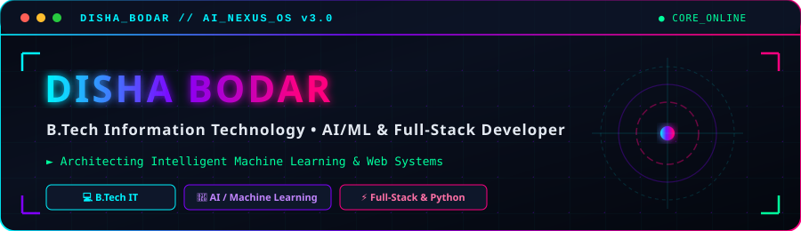

<div align="center">

<!-- Futuristic Cyberpunk Header Banner -->


<br/><br/>

[](https://git.io/typing-svg)

</div>


## 🖥️ Hero // Command Center

> *"I build practical software systems and intelligent applications while continuously exploring Artificial Intelligence, Machine Learning, and full-stack development."*

```
  ________________________________________________________________________________________
 /                                                                                        \
|   [SYSTEM PROFILE] :: DISHA BODAR                                                        |
|   ====================================================================================   |
|   • STATUS           : [ ONLINE // OPTIMAL ]                                             |
|   • CURRENT ROLE     : B.Tech Information Technology Student | Aspiring AI/ML Engineer     |
|   • PRIMARY FOCUS    : Artificial Intelligence • Machine Learning • Software Engineering |
|   • ACTIVE LEARNING  : Advanced NLP • Computer Vision (YOLOv8) • Deep Learning           |
|   • COLLABORATION    : Open to AI/ML & Software Development Internships                  |
 \________________________________________________________________________________________/
```

<br/>

<table align="center" width="100%">
  <tr>
    <td width="50%" stroke="#00f3ff">
      <h3>⚡ Developer Profile</h3>
      <ul>
        <li><b>Name:</b> Disha Bodar</li>
        <li><b>Degree:</b> B.Tech in Information Technology</li>
        <li><b>Core Interests:</b> AI/ML, Data Structures, Web Systems, Databases</li>
        <li><b>Location:</b> Available for Remote & On-site Internships</li>
      </ul>
    </td>
    <td width="50%">
      <h3>🎯 Command Status</h3>
      <ul>
        <li><b>Current Objective:</b> Engineering Intelligent Machine Learning Solutions</li>
        <li><b>Code Philosophy:</b> Scalable, Structured, Clean Architecture</li>
        <li><b>Git Activity:</b> Daily Commits & Active Skill Building</li>
        <li><b>Status:</b> Ready for Opportunities</li>
      </ul>
    </td>
  </tr>
</table>

<br/>


## 🚀 Mission Control

| Project ID | Project Name | Tech Stack | Status | Category |
| :--- | :--- | :--- | :---: | :---: |
| **`PRJ-01`** | **Fake News Detection** | `Python` `Scikit-learn` `NLP` `TF-IDF` | <kbd>🟢 ONLINE</kbd> | AI / ML |
| **`PRJ-02`** | **CafeTales** | `HTML` `CSS` `JS` `MySQL` `Node.js` | <kbd>🔵 ACTIVE</kbd> | Full Stack Web |
| **`PRJ-03`** | **Smart Trip Booking System** | `Python` `Booking Engine` `PDF Gen` | <kbd>🟣 COMPLETED</kbd> | Software System |
| **`PRJ-04`** | **IPL Ticket Booking System** | `Java` `DSA` `JDBC` `MySQL` `Threads` | <kbd>🟣 COMPLETED</kbd> | Data Structures |
| **`PRJ-05`** | **Scholarship & Inventory Manager**| `Java` `DSA` `MySQL` | <kbd>🟣 COMPLETED</kbd> | Java Desktop |

<br/>


## ⚡ Engineering Intelligence

<table width="100%">
  <tr>
    <td width="50%">
      <h4>🐍 Python Engine</h4>
      <code>[████████████████████] 90%</code> — <kbd><b>STRONG</b></kbd>
      <br/><br/>
      <h4>☕ Java Core &amp; Data Structures</h4>
      <code>[██████████████████  ] 85%</code> — <kbd><b>STRONG</b></kbd>
      <br/><br/>
      <h4>🧠 Machine Learning &amp; Analytics</h4>
      <code>[███████████████     ] 75%</code> — <kbd><b>FOCUS</b></kbd>
      <br/><br/>
      <h4>🗄️ SQL &amp; Database Management</h4>
      <code>[████████████████    ] 80%</code> — <kbd><b>INTERMEDIATE</b></kbd>
    </td>
    <td width="50%">
      <h4>🌐 JavaScript &amp; Web Stack</h4>
      <code>[██████████████      ] 70%</code> — <kbd><b>INTERMEDIATE</b></kbd>
      <br/><br/>
      <h4>💬 Natural Language Processing (NLP)</h4>
      <code>[███████████████     ] 75%</code> — <kbd><b>FOCUS</b></kbd>
      <br/><br/>
      <h4>👁️ Computer Vision (OpenCV / YOLO)</h4>
      <code>[████████████       ] 60%</code> — <kbd><b>LEARNING</b></kbd>
      <br/><br/>
      <h4>🛠️ System Design &amp; Architecture</h4>
      <code>[██████████████      ] 70%</code> — <kbd><b>WORKING</b></kbd>
    </td>
  </tr>
</table>

<br/>


## ⚙️ Core Technology Stack

```
========================================================================================
                          [ TECHNICAL CONSOLE // STACK MATRIX ]
========================================================================================
```

### 💻 Programming Languages


### 🧠 Artificial Intelligence & Data Science


### 🌐 Web & Backend Architecture


### 🗄️ Database Systems


### 🛠️ Developer Tools & Environments


<br/>


## 🧠 AI / ML Research Lab

```
┌────────────────────────────────────────────────────────────────────────────────────────┐
│                        [ MODULE: AI & MACHINE LEARNING LAB ]                          │
└────────────────────────────────────────────────────────────────────────────────────────┘
```

<table width="100%">
  <tr>
    <td width="50%">
      <h3>📊 Machine Learning</h3>
      <ul>
        <li><b>Supervised Algorithms:</b> Classification &amp; Regression</li>
        <li><b>Instance-Based:</b> K-Nearest Neighbors (KNN)</li>
        <li><b>Tree Models:</b> Decision Trees, Random Forest</li>
        <li><b>Margin Classifiers:</b> Support Vector Machines (SVM)</li>
        <li><b>Evaluation:</b> Confusion Matrix, Precision/Recall, ROC-AUC</li>
      </ul>
    </td>
    <td width="50%">
      <h3>💬 Natural Language Processing</h3>
      <ul>
        <li><b>Text Vectorization:</b> TF-IDF (Term Frequency-Inverse Document Frequency)</li>
        <li><b>Text Processing:</b> Tokenization, Lemmatization, Stop-word removal</li>
        <li><b>Applications:</b> Fake News Classifier, Sentiment Analysis</li>
        <li><b>Libraries:</b> NLTK, Scikit-learn Feature Extraction</li>
      </ul>
    </td>
  </tr>
  <tr>
    <td width="50%">
      <h3>👁️ Computer Vision</h3>
      <ul>
        <li><b>Object Detection:</b> YOLOv8 real-time detection</li>
        <li><b>Image Processing:</b> OpenCV image transformations &amp; filters</li>
        <li><b>Feature Extraction:</b> Edge detection, contour mapping</li>
      </ul>
    </td>
    <td width="50%">
      <h3>📈 Data Science &amp; EDA</h3>
      <ul>
        <li><b>Data Wrangling:</b> Pandas DataFrames &amp; NumPy Matrix operations</li>
        <li><b>Visualization:</b> Matplotlib, Seaborn custom plots</li>
        <li><b>Pipeline:</b> Cleaning, handling missing values, feature scaling</li>
      </ul>
    </td>
  </tr>
</table>

<br/>


## 💻 Project Showcase

<div align="center">
  <h3>🔍 Highlighted Engineering Projects</h3>
</div>

### 1. 📰 Fake News Detection System
> **Core Category:** Machine Learning &amp; Natural Language Processing  
> **Tech Stack:** `Python` • `Scikit-Learn` • `TF-IDF Vectorizer` • `NLP`  
> **Overview:** Designed an intelligent text classification pipeline that analyzes news articles and accurately flags misinformation. Uses TF-IDF feature extraction combined with supervised classification models.

### 2. 🍽️ CafeTales — Restaurant & Reservation System
> **Core Category:** Full Stack Web Application &amp; Database Engineering  
> **Tech Stack:** `HTML5` • `CSS3` • `JavaScript` • `MySQL` • `Node.js`  
> **Overview:** Interactive web platform featuring full menu exploration, real-time table reservation system, order cart management, and seamless database checkout integration.

### 3. ✈️ Smart Trip Booking Engine
> **Core Category:** Python Software Engineering &amp; Automation  
> **Tech Stack:** `Python` • `Modular Design` • `PDF Generator`  
> **Overview:** Travel reservation application coordinating flights, hotels, and transport options. Includes automated booking validation and dynamic PDF ticket generation.

### 4. 🏏 IPL Ticket Booking & Queue Management System
> **Core Category:** Java Data Structures &amp; Multithreading  
> **Tech Stack:** `Java` • `Data Structures (Queue, Stack, BST)` • `JDBC` • `MySQL`  
> **Overview:** High-concurrency ticket reservation engine demonstrating core data structures, thread safety, multithreaded booking queues, and relational persistence.

### 5. 🎓 Scholarship & Inventory Management Systems
> **Core Category:** Object-Oriented Software Development  
> **Tech Stack:** `Java` • `OOP` • `MySQL Workbench`  
> **Overview:** Management utilities enforcing data integrity, custom data structures, relational schema design, and CRUD operation handling.

<br/>


## 📊 GitHub Intelligence

<div align="center">

<table border="0">
  <tr>
    <td>
      
    </td>
    <td>
      
    </td>
  </tr>
</table>

<br/>


</div>

<br/>


## 📈 Contribution Activity

```
========================================================================================
                     [ QUANTUM TIMELINE // CONTRIBUTION MATRIX ]
========================================================================================
```

<div align="center">
  
</div>

<br/>


## 🗺️ Learning Pipeline

```
┌────────────────────────────────────────────────────────────────────────────────────────┐
│                              [ ROADMAP // EXPLORATION ]                                │
└────────────────────────────────────────────────────────────────────────────────────────┘
```

```
[01 // CURRENT FOUNDATION]
 ├── Python & Java Core Systems
 ├── Data Structures & Algorithms (DSA)
 ├── Relational Databases & SQL Optimization
 └── Full Stack Web Technologies
       │
       ▼
[02 // NEXT LEVEL HORIZONS]
 ├── Machine Learning Algorithms (SVM, Ensemble Methods)
 ├── Natural Language Processing (TF-IDF, Transformers)
 ├── Computer Vision (YOLOv8, OpenCV Feature Analysis)
 └── End-to-End MLOps Pipelines
       │
       ▼
[03 // FUTURE VISION]
 ├── Advanced Deep Learning & Neural Architectures
 ├── Intelligent Autonomous Systems
 └── Scalable Production AI Software Engineering
```

<br/>


## 📜 Verified Certifications

```
========================================================================================
                            [ VERIFIED CREDENTIAL MATRIX ]
========================================================================================
```

- 🐍 **Python for Data Science, AI & Development** — *IBM*
- 🌐 **Introduction to HTML, CSS & JavaScript** — *IBM*
- 🗄️ **Database Structures and Management with MySQL** — *Meta*
- ☕ **Inheritance and Data Structures in Java** — *University of Pennsylvania*

<br/>


## 🌐 Connect Matrix

<div align="center">

| Platform | Channel | Link |
| :--- | :--- | :--- |
| **GitHub** | `@Disha144` | [github.com/Disha144](https://github.com/Disha144) |
| **LinkedIn** | `Disha Bodar` | [linkedin.com/in/Disha144](https://linkedin.com) |
| **Email** | `bodarda06@gmail.com` | [bodarda06@gmail.com](mailto:bodarda06@gmail.com) |

<br/>

[](https://github.com/Disha144)
[](https://linkedin.com)
[](mailto:bodarda06@gmail.com)

</div>

<br/>


<div align="center">

```
========================================================================================
               ⚡ BUILD  •  LEARN  •  CREATE  •  INNOVATE ⚡
                        "Always learning. Always building."
========================================================================================
```

<sub>Designed for **Disha Bodar** • Developer Command Center Portfolio</sub>

</div>
